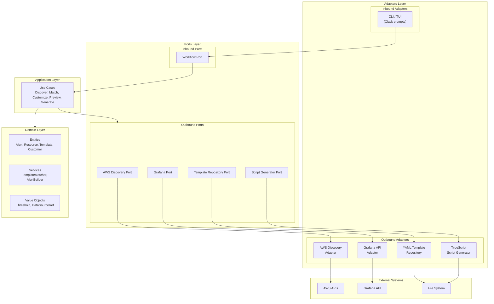
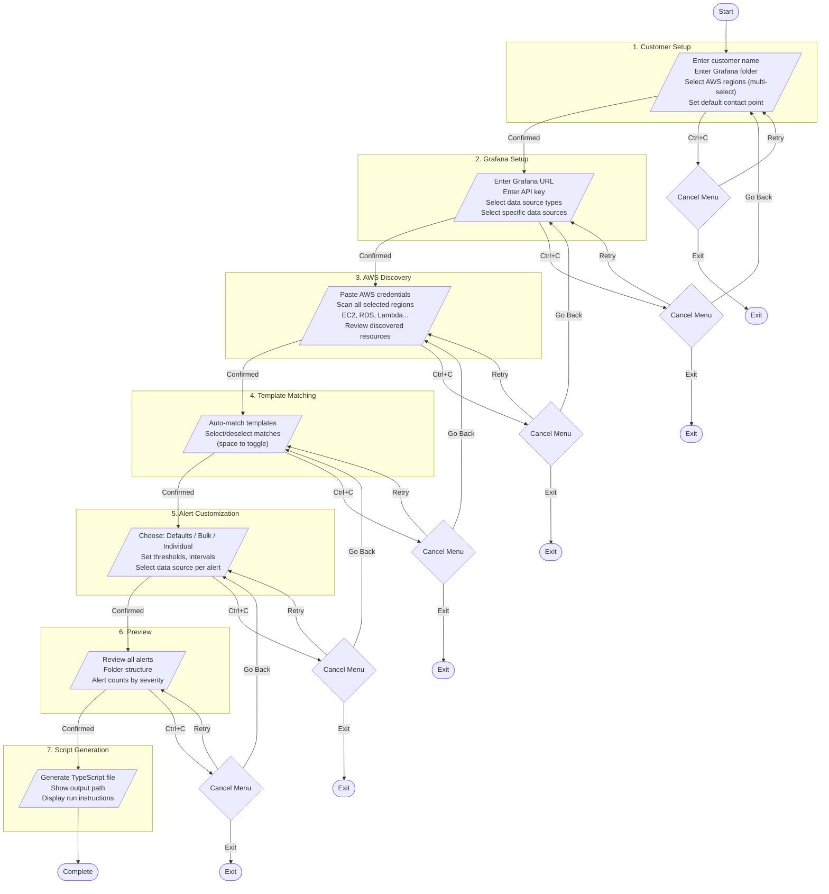
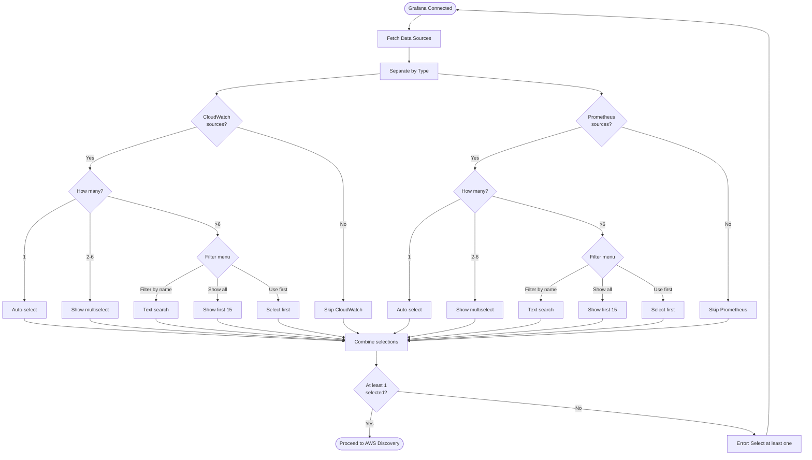
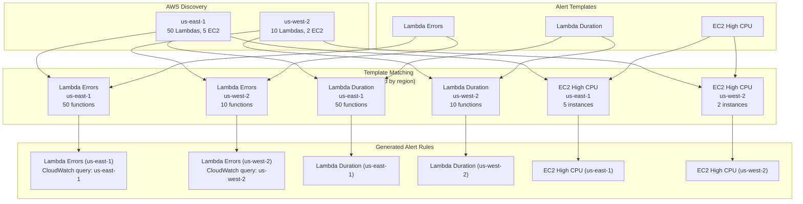

# Alert Provisioner - Architecture & Flow Diagrams

Visual documentation for the AWS-to-Grafana Alert Provisioner.

## Table of Contents

- [Data Flow](#data-flow)
- [Hexagonal Architecture](#hexagonal-architecture)
- [TUI Workflow](#tui-workflow)
- [Data Source Selection](#data-source-selection)
- [Multi-Region Alert Generation](#multi-region-alert-generation)

---

## Data Flow

How data moves through the system from inputs to generated script.

```mermaid
flowchart LR
    subgraph Inputs["Input Sources"]
        AWS["AWS Account<br/>(multiple regions)"]
        Grafana["Grafana Instance"]
        Templates["YAML Templates"]
        User["User Input"]
    end

    subgraph Processing["Processing"]
        Discovery["AWS Discovery<br/>(per region)"]
        DataSources["Data Source<br/>Selection"]
        Matcher["Template<br/>Matcher<br/>(groups by region)"]
        Builder["Alert<br/>Builder"]
    end

    subgraph Outputs["Output"]
        Script["TypeScript<br/>Script"]
        Preview["Alert<br/>Preview"]
    end

    AWS --> |EC2, RDS, Lambda...<br/>from each region| Discovery
    Grafana --> |CloudWatch, Prometheus| DataSources
    Templates --> |Alert definitions| Matcher
    User --> |Customer info, regions, thresholds| Builder

    Discovery --> |DiscoveredResources<br/>with region| Matcher
    DataSources --> |Selected DataSources| Builder
    Matcher --> |TemplateMatches<br/>(one per template+region)| Builder
    Builder --> |AlertRules<br/>(region-specific)| Preview
    Builder --> |AlertRules| Script

    Script --> |"output/*.ts"| Run["Run against<br/>Grafana API"]
```

---

## Hexagonal Architecture

The application follows hexagonal (ports & adapters) architecture to keep the domain logic isolated from external dependencies.



### Layer Responsibilities

| Layer | Purpose |
|-------|---------|
| **Domain** | Pure business logic, no external dependencies |
| **Ports** | Interface contracts (what, not how) |
| **Adapters** | Implementations (AWS SDK, Clack, filesystem) |
| **Application** | Use case orchestration |

---

## TUI Workflow

The 7-step state machine workflow with navigation controls.



### Navigation Summary

| Step | Cancel Options |
|------|----------------|
| 1. Customer Setup | Retry, Exit |
| 2. Grafana Setup | Retry, Go Back, Exit |
| 3. AWS Discovery | Retry, Go Back, Exit |
| 4. Template Matching | Retry, Go Back, Exit |
| 5. Alert Customization | Retry, Go Back, Exit |
| 6. Preview | Retry, Go Back, Exit |
| 7. Script Generation | (completes workflow) |

---

## Data Source Selection

How the Grafana data source selection adapts to different scenarios.



### Selection Behavior by Count

| Count | UX Behavior |
|-------|-------------|
| 0 | Type skipped |
| 1 | Auto-selected with message |
| 2-6 | Direct multiselect (space to toggle) |
| >6 | Menu: Filter by name / Show all (max 15) / Use first |

### Supported Data Source Types

| Type | Grafana Data Source |
|------|---------------------|
| CloudWatch | `cloudwatch` |
| Prometheus | `prometheus`, `cortex`, `mimir` |

---

## Multi-Region Alert Generation

How resources from multiple regions are grouped into alert rules.



### Why Region-Specific Alerts?

CloudWatch queries are inherently region-specific. A single CloudWatch query:
- Can only fetch metrics from **one** AWS region
- Cannot aggregate metrics across regions

Therefore, the provisioner creates:
- One alert rule per (template, region) combination
- Each rule uses multi-dimensional alerting to cover all resources in that region
- Alert titles include region suffix when multiple regions are scanned

### Example Output

| Template | Regions Scanned | Resources Found | Alert Rules Created |
|----------|-----------------|-----------------|---------------------|
| Lambda Errors | us-east-1, us-west-2 | 50 in us-east-1, 10 in us-west-2 | 2 (one per region) |
| EC2 High CPU | us-east-1, us-west-2 | 5 in us-east-1, 0 in us-west-2 | 1 (us-east-1 only) |
| RDS Low Storage | us-east-1, us-west-2 | 0 in both | 0 (no resources) |

**Key Point**: Alerts are only created for regions where resources actually exist. Scanning multiple regions does NOT create empty alerts for regions without matching resources.
